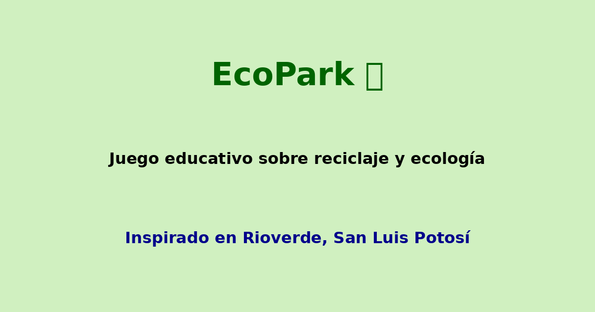

# EcoPark 🌱

**EcoPark** es un juego educativo web diseñado para enseñar sobre reciclaje y cuidado del medio ambiente, inspirado en las áreas ecológicas de *Rioverde, San Luis Potosí*.

## 🎮 Características

- Niveles con paisajes reales de Rioverde.
- Temporizador, puntuación y sonidos ambientales.
- Tablas de historial y opción para compartir en redes.
- Estilo visual atractivo para captar la atención de los usuarios.

## 📁 Estructura del proyecto

```
ecopark-juego/
│
├── index.html
├── favicon.ico
├── og_ecopark.png
├── portada_ecopark.png
│
└── assets/
    ├── images/
    │   ├── parque_lineal_rioverde.jpg
    │   ├── media_luna_rioverde.jpg
    │   └── los_peroles_rioverde.jpg
    └── audio/
        ├── click.mp3
        └── reciclaje.mp3
```


---


Inspirado en la biodiversidad de **Rioverde, S.L.P.**
