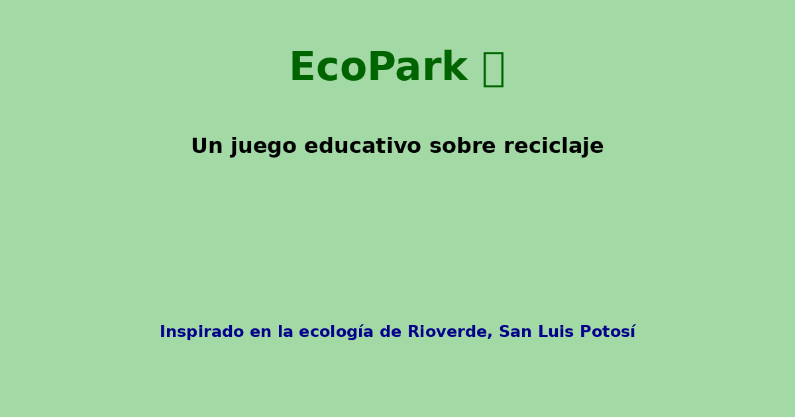

# EcoPark 🌱

EcoPark es un juego educativo web sobre reciclaje y el cuidado del medio ambiente. Inspirado en las áreas ecológicas de Rioverde, San Luis Potosí, este juego busca enseñar a través de la interacción y el juego.

## Características

- 🎮 Múltiples niveles con fondos de sitios reales.
- ♻️ Recolección de residuos reciclables con puntuación.
- 🔊 Sonidos y animaciones que mejoran la experiencia.
- 📈 Historial y récord personal.
- 📱 Compartir tu puntuación en redes sociales.

## ¿Cómo jugar?

1. Inicia el juego desde `index.html`.
2. Recoge los residuos tocando o haciendo clic sobre ellos.
3. Sube tu puntuación y compártela con tus amigos.

